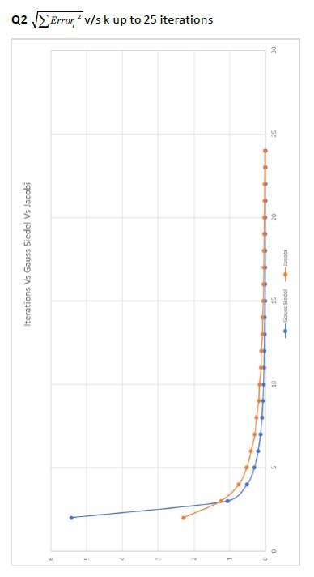
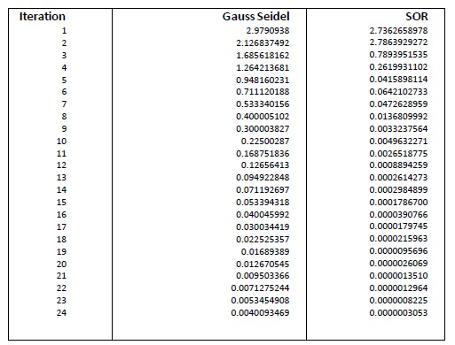
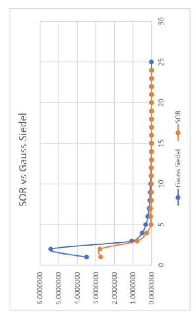

# Gauss Seidel, Jacobi, and SOR Gauss Seidel
 Gauss Seidel, Jacobi, and SOR Gauss Seidel

<b>Part 1</b>-Write a C program to solve N linear equations via Gauss Seidel and Jacobi method.

<b>Part 2</b>- Upto 25 iterations draw the  vs k (k is the iteration number) for GS and Jacobi method for the following set of equations starting with initial guess of x(0) = [1  2  1]T.

 
The convergence of Gauss Seidel technique can be speeded up using successive over-relaxation (SOR). 

<b>Part 3</b>- Solve the matrix in Q2, with the same guess values but with SOR with w=1.5 and make a comparative study with the GS method to see the convergence with iteration. (Do things via a computer program). The solution of the given set of equations are x = [3  -5  9]T.

<b>Analysis</b>-

Since the updated values of the unknowns were used at each stage of the iteration proceeding to the next stage, the numerical results and errors showed that the Gauss Seidel was more rapid in convergence than Jacobian.
The data in the table above shows that SOR method takes relatively less iterations than Gauss Seidel to converge. Due to less iterations, SOR takes less computer storage than the Gauss Seidel method. The SOR method takes the form of a weighted average between the previous iterate and the computed Gauss-Seidel iterate successively for each component. Choosing a suitable value for w, accelerates the rate of convergence of the iterates to the solution.
SOR can thus be considered the most effective of the three methods.

